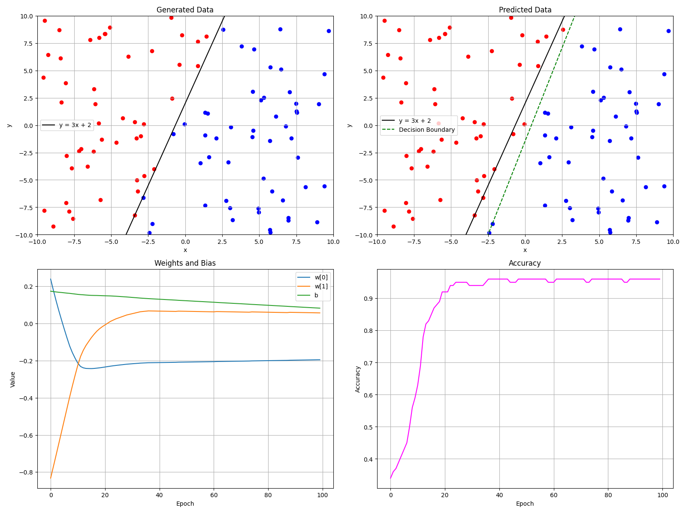
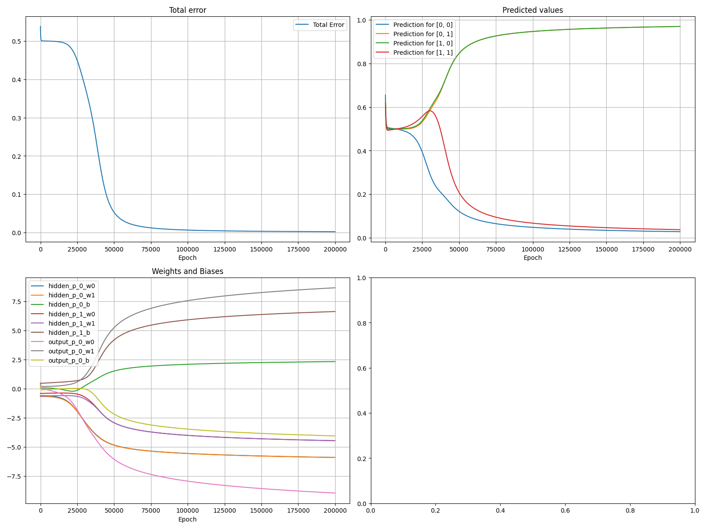
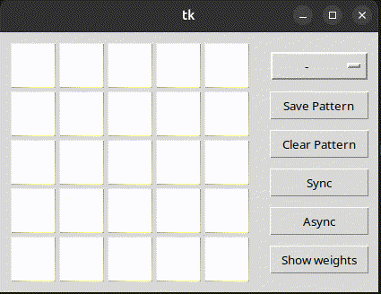
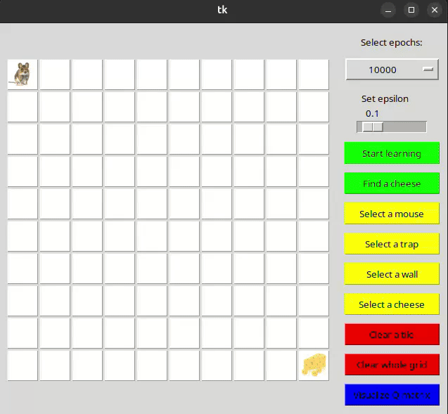
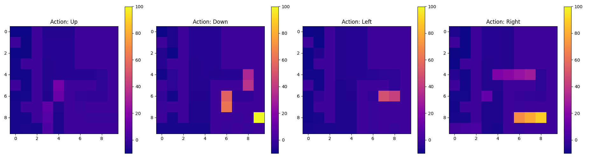
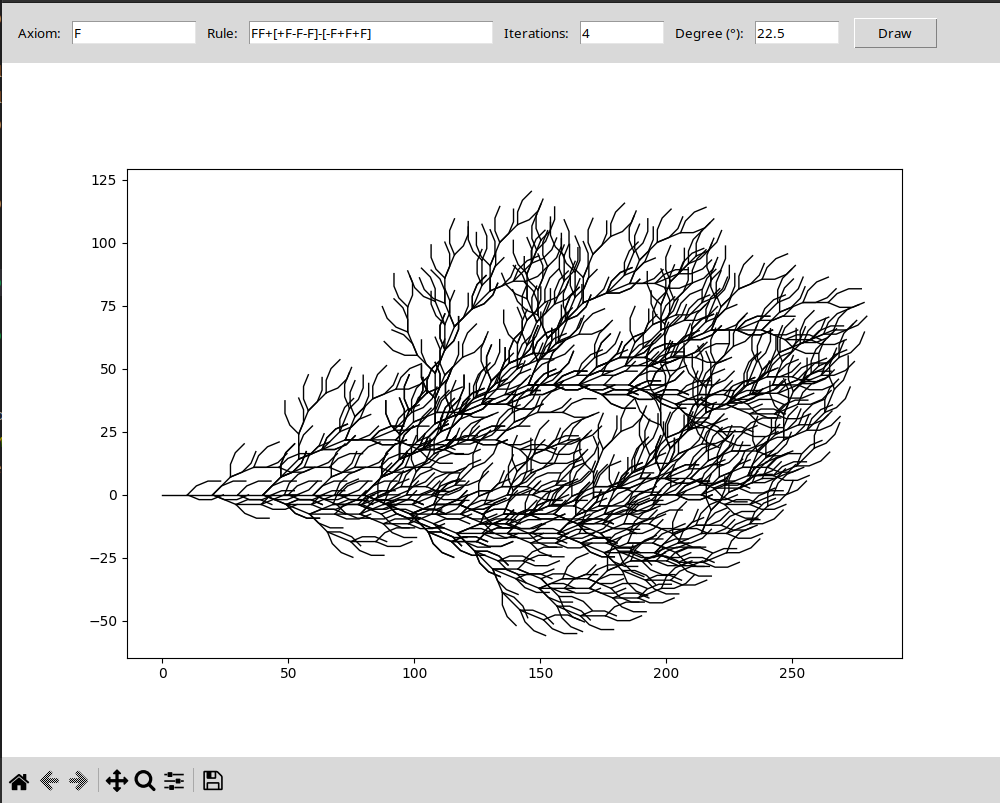
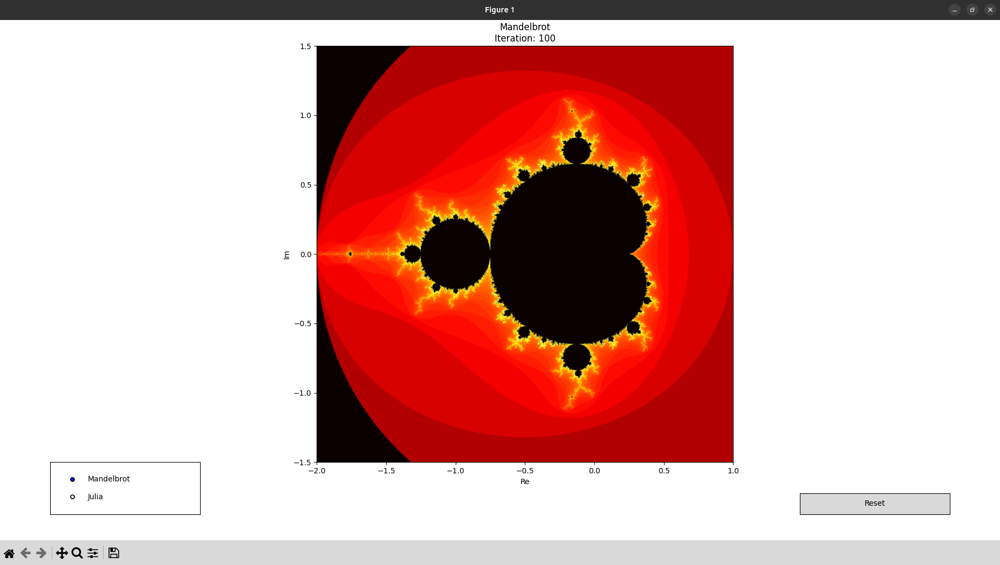
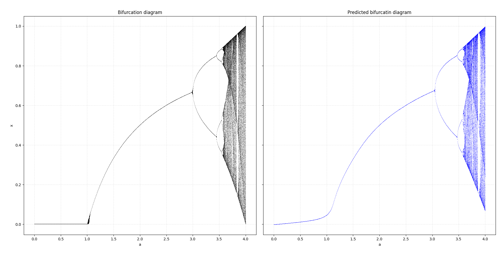
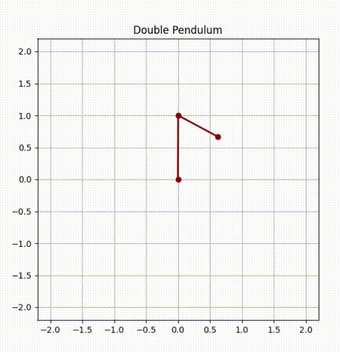

# NAVY

## 01: Perceptron

### Task:

Generate random 2D points and predict if they are below or above the line defined by linear function _y=3x+2_. Visualize the solution.

### Solution:

Implemented single perceptor with two imputs and signum activation function. Imput weigts and bias were balanced using product of learning rate, error and input. Prediction was made by sum of products of weights and input, plus bias.

### Visualization:



- Top left: Generated data and line defined by linear function
- Top right: Perceptron predictions with decision boundart
- Bottom left: Evolution of weights and bias in training epochs
- Bottom right: Evolution of perceptron accuracy in training epochs

## 02: XOR Problem

### Task:

Use a neural network to solve the XOR problem.

### Solution:

Implemented fully connected neural network with sigmoid activation function in every neuron. Solution used for XOR problem contains one hidden layer with two neurons and output layer with one neuron. Prediction was made using forward propagation and using activation function. Learning included prediction for selected input, error calculation using MSE (Mean Square Error) and weights+bias correction. For this, backward propagation was used. It started from output layer and go back into input layer. Weight delta of n-layer neuron is calculated as sum of products n+1-layer weight deltas and weights. This is mutliplayed by derivation of activation function used on perceptron output.

### Terminal output:

Network architecture and weights+biases before traning

```bash
--------------
Pre-training
--------------
MLP:
hidden:
hidden_p_0; w: [-0.5969314085842015, -0.6628871343538043]; b: 0.07596656650268119
hidden_p_1; w: [-0.3967756514531524, -0.6256754275930128]; b: 0.48861402801188514
output:
output_p_0; w: [0.20103082341774647, 0.39924267645104194]; b: 0.2895867483744847
----------------
```

Traing process with total error

```bash
---------------
Epoch 0, Total Error: 0.538405527622102
Epoch 20000, Total Error: 0.4854308550821145
Epoch 40000, Total Error: 0.1875466359357718
...
Epoch 180000, Total Error: 0.0022758752580269363
---------------
```

Network architecture and weights+biases after traning

```bash
-------------
Post-training
-------------
MLP:
hidden:
hidden_p_0; w: [-5.900735186059314, -5.906617292413846]; b: 2.332701429610526
hidden_p_1; w: [-4.462690174937236, -4.463962292771719]; b: 6.631605875946858
output:
output_p_0; w: [-8.95799152309827, 8.67224598628567]; b: -4.05190095227655
--------------
```

Evaluation of trained model

```bash
---------------------
Results:
Input: [0, 0] -> Predicted: [0.0277] | Expected: [0]
Input: [0, 1] -> Predicted: [0.9703] | Expected: [1]
Input: [1, 0] -> Predicted: [0.9703] | Expected: [1]
Input: [1, 1] -> Predicted: [0.037] | Expected: [0]
---------------------
```

### Visualization:



- Top left: Evolution of total in training epochs
- Top right: Evolution of predicted outputs in training epochs
- Bottom left: Evolution of weights and biases in training epochs
- Bottom right: Empty

## 03: Hopfield Networks

### Task:

Use the Hopfield network to save and recover patterns. Implement synchronous and asynchronous recovery.

### Solution:

Implemented GUI in Tk with $N \times N$ matrix, representing Hopfield network with $N^2$ neurons. Created 3 templates for $5 \times 5$ and $7 \times 7$ grid. These templates can be edited. In process of learning of Hopfield network, first $N^2 \times N^2$ memory matrix is created and filled with zeroes. Every training pattern, represented as $N \times N$ matrix of 1 and -1, is transformed into single row matrix and multiplied by transponed version of itself. In result, values on diagonal are set to 0 and then added to memory matrix. In recovery, recovered pattern is transformed into single row matrix. New values of recovered pattern are then calulated as scalar multiplication of recovered pattern and i-row of memory matrix. Signum function is used to result to reduce it to 1 or -1. In synchronous recovery, pattern is updated on end of iteration. In asynchronous recovery, pattern is updated with every new value.

### Visualization:


Example of sync recovery of $5 \times 5$ pattern.

## 04: Q-learning

### Task:

Use Q-Learning to find out the cheese and to avoid the traps or walls. Walker cannot step on the place denoted as a traps. In the opposite case, the game is over. Walker can not walk through walls.

### Solution:

Implemented GUI in Tk with $N \times N$ grid, representing playing area. One mouse and cheese can be placed in this area. Also infinite number of walls or traps can be placed. Agent have four actions - go up, down, left or right by one tile. In learning, first is randomly decided between exploration and choosing current best action (set by epsilon). Then, new position is calculated based on current position and selected action and checked, if new position is not outside playing area or in wall. If so, agent is returned to previous postion and penalty is given to agent. If agent steps into trap, penalty also given, but learning epoch ends. For every non-cheese tile, small penalty is also added to reduce number of steps. Then, Q-matrix is recalculated at position and action. For searching, best action is always selected.

### Visualization:


Example of playground creation and cheese finding.

Q-matrix for learned agent for playground above.

## 08: CartPole - Optimized Q-learning

### Task:

Solve the CartPole balancing task using optimized Q-learning with a discretized state space. The agent should learn to keep the pole balanced for as long as possible.

### Solution:

Implemented Q-learning agent using discretized state space to reduce the infinite continuous space into manageable buckets. Special care was taken to refine discretization around the critical pole angle close to vertical position. The Q-table was initialized optimistically to encourage exploration. A shaped reward function was introduced penalizing large pole angles and proximity to the edges. Training included early stopping based on stability tests. The best model was selected based on the average reward across multiple test episodes.

Key improvements:

- Adaptive epsilon and learning rate decay.
- Reward shaping penalizing unsafe states.
- Optimistic Q-table initialization.
- Stability check requiring agent to balance for multiple episodes.

### Training output:

Training process showing evolution of agent performance during learning:

```bash
Training round 1/5
Ep 0: Reward = 24.0, Max = 24.0
Ep 100: Reward = 96.0, Max = 196.0
Ep 200: Reward = 230.0, Max = 423.0
Ep 300: Reward = 512.0, Max = 782.0
...
Good solution found in 472 with reward 935.0
Stable model found!
Average test reward: 920.5
New best reward: 920.5
```

Average reward for best model:

```bash
Best avg reward: 1139.9
```

### Visualization:

During visualization, the agent consistently balances the pole for hundreds of steps.

```bash
Visualization of trained model!

Test 1: Steps: 1000.0
Test 2: Steps: 1000.0
Test 3: Steps: 71.0
Test 4: Steps: 1000.0
Test 5: Steps: 1000.0
```

## 06: L-System

### Task:

The L-system (Lindenmayer system) is a system defined by its axiom formula, rewritten by
each rule that can be rotated at a specific angle. Brackets can be used for creating a
checkpoint to which the position will be returned after the closing bracket is met.

### Solution:

Implemented a recursive L‑System generator where the initial axiom is expanded by applying the production rule for a given number of iterations. The interpretation of the generated string is done by a function that computes new drawing coordinates by processing each command ("F", "+", "-", "[", "]") and handling branchings using a stack. A simple GUI built with Tkinter allows users to input parameters and view the generated fractal pattern. Matplotlib is used for the graphical rendering.

### Visualization:


Example of rule _FF+[+F-F-F]-[-F+F+F]_ with 4 iterations.

## 08: Fractal Explorer

### Task:

Create an interactive explorer for Mandelbrot and Julia fractals, allowing the user to zoom into specific regions and switch between both fractals.

### Solution:

Implemented an interactive fractal explorer using matplotlib. Application allows switching between Mandelbrot set and Julia set with a fixed constant _c = -0.7 + 0.27i_. View can be zoomed into by clicking and dragging on the plot. Upon switching fractal type, the view is reset to default settings. Fractals are computed using a fixed maximum of 100 iterations without increasing iterations during runtime.

### Visualization:



- Full window: Current fractal (Mandelbrot) with interactive zoom
- Controls on bottom:
  - Left: Switch between Mandelbrot and Julia
  - Right: Reset view to default
- Zoom: Click and drag a rectangle on the fractal to zoom into selected region

# 10: Theory of chaos: Logistic map, chaotic numbers and their prediction

### Task:

Generate a bifurcation diagram of the logistic map defined by the recurrence relation $x_{n+1} = a \cdot x_n \cdot (1 - x_n)$

Then, use a neural network to predict the evolution of the system. Compare the real bifurcation diagram with the predicted one.

### Solution:

- Generated 100,000 samples of pairs $[a, x_n]$ and computed corresponding $x_{n+1}$ as training targets.
- Built a feed-forward neural network with two hidden layers (64 neurons each, `tanh` activation).
- Trained using Mean Squared Error loss and Adam optimizer.

### Visualization:



- **Left**: Bifurcation diagram calculated using logistic map formula.
- **Right**: Predicted bifurcation diagram using the neural network.

# 11: Double pendulum and chaotic motion

### Task:

Simulate the chaotic behavior of a double pendulum.

### Solution:

- The system consists of two masses connected by two massless rods.
- Masses, lenghts and angles are randomized on start.
- Lagrangian mechanics is used to derive equations of motion based on potential and kinetic energy.
- Differential equations are solved numerically using `odeint` from `scipy.integrate`.

### Visualization:



- **Blue** trail: recent trajectory of the second pendulum mass

# 12: Cellular automata - forest fire algorithm

### Task:

Simulate the spread of a forest fire using a cellular automaton model.

### Solution:

- The forest is represented as a 2D grid where each cell can be in one of four states:
  - Ground
  - Tree
  - Fire
  - Ash
- At each iteration:
  - Ground can turn into Tree with probability `p`
  - Trees can spontaneously ignite with a probability `f`.
  - Trees adjacent to burning trees will catch fire.
  - Burning trees turn into ash.
  - Ash can turn back into ground, with a higher probability of spawning a new tree due to fertile soil.
- The simulation uses either the Neumann or Moore neighborhood to determine adjacency.

### Visualization:


- **Left**: Forest grid showing the current state of each cell.
- **Right**: Pie chart indicating the distribution of states in the forest at the current iteration.
